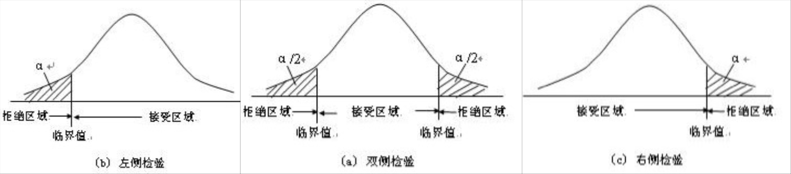
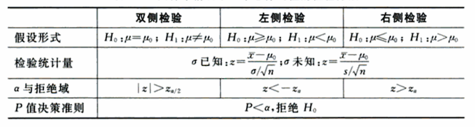
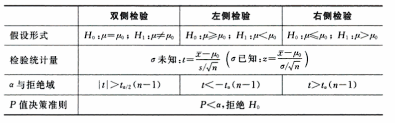
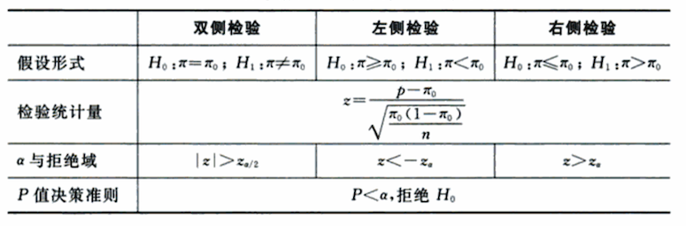
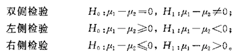

##### 　　最近产品提出需求，对于ab实验，希望能够通过实验数据计算出P值，以对数据的准确性做一个直观判断。最开始不知道P值是一个什么概念，觉得应该很简单，baidu或者google以下应该会有很多开源的代码或者jar包；又或者是自己将P值公式实现便可。但是一番查找后发现没有想的这么简单，网络上对于P值得计算过程大多含糊不清，更别提完整的计算代码。最后没办法，只有通过自己拿起概率论书本重新进行学习，以下便记录自己从P值是什么到java实现的一些细节。
<!--more-->

## 1. 统计学中P值
##### 　　P值是指当假设为真时所得到的观察结果的概率，简单讲P值就是概率，反映某一事件发生的可能性大小。下面几个比较重要的基础概念对于理解P值的意义会有帮助。
### 1.1 概率论中几个比较重要的基础概念
#### 1.1.1 原假设与备择假设：
##### __原假设（H0）__：通常将研究者想手机证据予以反对的假设称为原假设，用H0表示；
##### __备择假设（H1）__：通常将研究者想收集证据予以支持的假设称为备择假设，或称研究假设，用H1活H2表示。

##### 　　举个栗子：

<pre class="highlight"><code>某品牌洗涤剂在产品说明书中声称：平均净含量不少于500g。从消费者利益出发，有关研究人员要通过抽检其中的一批产品来验证该产品制造商的说明是否属实。    
解：对于该洗涤剂的平均含量的真值为μ。如果抽检的结果发现μ<500，则表明该产品说明书中关于其净含量的内容是不真实的。一般来说，研究者抽检的意图是倾向于证实这种洗涤剂的平均净含量不符合说明书中的概述，因为这不符合说明书的陈述。如果研究者对于产品说明丝毫没有质疑，也就没有必要抽检了。所以μ<500是研究者想要收集证据支持的观点。    
 <h6>H0:μ≥500(净含量符合说明书);</h6><h6>H1:μ&lt;500(净含量不符合说明书)。</h6></code></pre>

<pre class="highlight"><code>一家研究机构估计，某城市中家庭拥有汽车的比例超过30%。为了验证这一估计是否正确，该研究机构随机抽取了一个样本进行检验。     
解：设该城市中家庭拥有汽车的比例真值为π。显然，研究者想收集证据予以支持的假设是:该城市中家庭拥有汽车的比例超过30%。因此建立的原假设与备择假设应为
<h6>H0:π≤30%（家庭拥有汽车的比例不超过30%）;</h6><h6>H1:π>30%（家庭拥有汽车的比例超过30%）。</h6></code></pre>

* 原假设和备择假设是一个完备事件组，而且互相对立。也就是说在一项假设检验中，必有且只有一个成立；
* 在假设检验中，等号"="总是放在原假设上。   

#### 1.1.2 单侧检验和双侧检验：
##### __单侧检验__：备择假设具有特定的方向性，并含有符号">"或"<"的假设检验；
##### __双侧检验__：备择假设没有特定的方向性，并含有符号"≠"的假设检验。     
    
假设检验的基本形式

#### 1.1.3 两类错误与显著水平    
##### 　　如前所述，原假设与备择假设不能同时成立，我们要么拒绝原假设，要么不拒绝原假设。我们希望的情况是：当原假设正确时没有拒绝它，当原假设不正确时拒绝它。但是我们无法保证不犯错。假设检验中过程中可能发生以下两类错误：    
##### __I类错误__：当原假设为真是拒绝原假设，所犯的错误称为第I类错误；    
##### __II类错误__：当原假设为假时没有拒绝原假设，所犯错误称为第II类错误。    
   
假设检验的结论与后果

##### 　　只有当原假设被拒绝时，我们才会犯第I类错误；只有当原假设未被拒绝时，我们才会犯第II类错误。因此，我们可以不犯第I类错误或不犯第II类错误，但不可能两类错误都不犯。两类错误就像一个跷跷板，当一个概率增大时，另一个减小。人们只能在两类错误的发生概率之间进行平衡。一般来说，发生哪一类错误的后果更为严重，就应该首要控制哪类错误发生的概率，但由于犯第I类错误的概率是可以又研究者控制的，因为此在假设检验中，人们往往先控制第I类错误的发生概率。

``
发生第I类错误的概率常被用于度量检验结论的可靠性，并将这一概率称为显著性水平，记为α。
``

##### 　　__显著水平__ 是人们事先指定的犯第I类错误概率α的最大允许值。显著水平α越小，犯第I类错误的可能性自然就越小，但犯第II类错误的可能性则随之增大。作为一个普遍使用的原则，人们通常选择显著性水平为0.05或比0.05更小的概率。

#### 1.1.4 标准化检测量与拒绝域

##### 　　__检验统计量__ 实际上是总体参数的点估计量，但点估计量并不能直接作为检验的统计量，只有将其标准化后，才能用于度量它与原假设的参数之间的差异程度。实际上，假设检验中所用的检验统计量都是标准化检验统计量，它反映了点估计量（比如样本均值）与假设的总体参数（比如假设的总体均值）相比相差了多少个标准差。

$$标准化检验统计量 = \frac{点估计量 - 假设值}{点估计量的抽样标准差}$$

##### 　　__拒绝域__ 能够拒绝原假设的检验统计量的所有可能取值的集合。是由显著性水平α所围成的区域。如果利用样本观测结果计算出来的检验统计量的具体数值落在了拒绝域内，就拒绝原假设，否则就不拒绝原假设。

显著性水平、拒绝域和临界值

##### 　　当样本容量固定时，拒绝域的面积随α的减小而减小。α值越小，拒绝域假设所需的检验统计量的临界值与原假设的参数值就越远。

### 1.2 利用P值进行决策
##### 　　显著性水平α是在检验之前确定的，这也就意味着我们事先确定了拒绝域。这样，不论检验统计量的值是大是小，只要它的值落入拒绝域就拒绝原假设，否者就不拒绝原假设。这种固定的显著性水平α对检验结果只能提供检验结论可靠性的一个大致范围，无法给出观测数据与原假设之间不一致程度的精确度量。

##### 　　__P值__ 在原假设为真的条件下，检验统计量的观察值大于或等于其计算值的概率，称为P值。P值是反映实际观测到的数据与原假设之间不一致程度的一个概率值。P值越小，说明实际观测到的数据与原假设之间不一致的程度就越大，检验的结果也就越显著。

### 1.3 一个总体参数的检验
##### 　　当我们研究一个总体时，要检验的参数主要是总体均值μ、总体比例π和总体方差σ2。由于检验的参数不同，计算检验统计量的方法也有所不同。

#### 1.3.1 总体均值的检验
##### 　　对于总体均值进行假设检验，采用什么检验步骤和检验统计量取决于我们所抽取的样本是大样本（n≥30）还是小样本（n<30），此外还需要区分总体是否服从正太分布、总体方差σ2是否已知等几种情况。
    
大样本情况下一个总体均值的检验方法

    
小样本情况下一个总体均值的检验方法

##### 　　Z表示转换为标准正太分布下的检验统计量。

#### 1.3.2 总体比例的检验
##### 　　总体比例是指总体中具有某种相同特征的个体所占的比例，这些特征可以是数据型的（如一定的重量、一定的厚度或一定规格等），也可以是品质型的（如男女比例、学历等级、职称高低等）。
##### 　　在构造检验统计量时，我们仍然利用样本比例p与总体比例π之间的距离等于多少个标准差来衡量，因为在大样本情况下统计量p近似服从正太分布，而统计量
$$z = \frac{P - π_0}{\sqrt{\frac{π_0(1-π_0)}{n}}}$$

    
大样本情况下一个总体比例的检验方法

### 1.4 两个总体参数的检验
##### 　　在实际研究中，我们常常要比较两个总体的差异，如一所学校的重点班和普通班两个班级学生的英语成绩是否有显著差异；生产企业在改进生产线后的平均产量与原生产线的平均产量相比是否有显著提高等等。
    
两个总体均值之差的三种基本假设检验形式

## 2. JAVA实现P值计算
