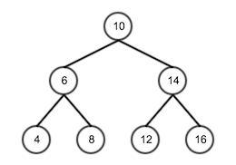

## 题目要求：
##### 输入一棵二元查找树，将该二元查找树转换成一个排序的双向链表。
##### 要求不能创建任何新的结点，只调整指针的指向。
<!--more-->
#### 举个例子

##### 转换成双向链表
##### 4=6=8=10=12=14=16
#### 首先我们定义的二元查找树 节点的数据结构如下：
``
struct BSTreeNode
{
  int m_nValue; // value of node
  BSTreeNode *m_pLeft;
  BSTreeNode *m_pRight; // right child of node
};*
``

## 分析过程：
##### 二元查找树的特征比较明显，每个节点最多有两个子节点，分别为左节点和右节点，左节点的所有值都小于该节点，右节点的值大于该节点。这个题目其实很简单，就是实现二叉树的中序遍历。中序遍历就是左中右遍历。

### 遍历过程，利用数据结构——栈实现，从根节点开始遍历
1. 判断是否有左节点，
　　1.1 如果有，则将该节点如栈，然后左节点重复流程1
　　1.2 如果没有，则将本节点写入链表尾部
　　1.3 判断是否有右节点
　　1.4 如果有，将右节点重复流程1
　　1.5 如果没有，执行流程2
2. 从栈顶拿出一个节点，如果没有节点，则遍历结束
　　2.1 将节点插入链表尾部
　　2.2 判断节点是否有右节点
　　2.3 有右节点，将右节点重复流程1
　　2.4 如果没有，执行流程2

#### 实例查找树的遍历过程
##### 1.根节点10开始遍历，判断有左节点，将10压入栈中
|&nbsp;&nbsp;|
| --- |
|&nbsp;10&nbsp;|
##### 2. 将左节点6重复流程1
|&nbsp;&nbsp;|
| --- |
|&nbsp;6&nbsp;|
|&nbsp;10&nbsp;|
##### 3. 将左节点4重复流程1，因为4没有做子节点，所以将4插入链表
|&nbsp;&nbsp;|
| --- |
|&nbsp;6&nbsp;|
|&nbsp;10&nbsp;|
　　　链表：4
##### 4. 4没有右节点，所以从栈顶中取出节点6进行流程2
|&nbsp;&nbsp;|
| --- |
|&nbsp;10&nbsp;|
　　　链表：4=6
##### 5. 6的右节点8执行流程1，8没有左节点，直接加入链表
|&nbsp;&nbsp;|
| --- |
|&nbsp;10&nbsp;|
　　　链表：4=6=8
##### 6. 8没有右节点，进入流程2，从栈顶取出
|&nbsp;&nbsp;|
| --- |
|&nbsp;&nbsp;&nbsp;&nbsp;&nbsp;|
　　　链表：4=6=8=10
##### 7. 10有右节点，10的右节点14进入流程1，14有左节点，所以压入栈中
|&nbsp;&nbsp;|
| --- |
|&nbsp;14&nbsp;|
　　　链表：4=6=8=10
##### 8. 14的左节点12进入流程1，12没有左节点，直接插入链表
|&nbsp;&nbsp;|
| --- |
|&nbsp;14&nbsp;|
　　　链表：4=6=8=10=12
##### 9. 12没有右节点，所以进入流程2，从栈顶中取出14并加入链表，14有右节点16，所以16进入流程1
|&nbsp;&nbsp;|
| --- |
|&nbsp;&nbsp;&nbsp;&nbsp;&nbsp;|
　　　链表：4=6=8=10=12=14=16
##### 10. 16没有右节点，进入流程2，栈中没有元素，流程结束
　　　最终链表：4=6=8=10=12=14=16

## python实现：
```python
#!/usr/bin/env python
# -*- coding:utf-8 -*-

"""节点属性"""
class BSTreeNode (object):

    def __init__(self, value, left, right):
        self.value = value
        self.left = left
        self.right = right

class Stack:
    """模拟栈"""
    def __init__(self):
        self.items = []

    def isEmpty(self):
        return len(self.items)==0

    def push(self, item):
        self.items.append(item)

    def pop(self):
        return self.items.pop()

    def size(self):
        return len(self.items)
now = 0

"""链表插入节点"""
def __addNode(node):
    global now
    if now != 0:
        now.right = node
        node.left = now
    now = node

"""初始化查找树"""
def __initTree():
    t4 = BSTreeNode(4, None, None)
    t8 = BSTreeNode(8, None, None)
    t6 = BSTreeNode(6, t4, t8)
    t12 = BSTreeNode(12, None, None)
    t16 = BSTreeNode(16, None, None)
    t14 = BSTreeNode(14, t12, t16)
    t10 = BSTreeNode(10, t6, t14)
    return t10

stack = Stack()

"""流程1"""
def __sort(tree):
    global stack
    if tree.left != None:
        stack.push(tree)
        return __sort(tree.left)
    else:
        __addNode(tree)
    if tree.right != None:
        __sort(tree.right)
    else:
        __fromStack()

"""流程2"""
def __fromStack():
    global stack
    if stack.isEmpty():
        return
    node = stack.pop()
    __addNode(node)
    if node.right != None:
        __sort(node.right)
    else:
        __fromStack()

def __print():
    global now
    while now.left != None:
        print now.value
        now = now.left
    print now


if __name__ == "__main__":
    tree = __initTree()
    __sort(tree)
    __print()
```
## 最后再说一些：
##### 本身题目不是很难，把大学学习的数据结构拿出来看一看就明白了，完成之后我也去网络中找了找这道题，其他人也基本是用中序遍历的方法，大多只有代码，没有解题思路，所以我也没有仔细去看，默认自己是对的。这题目比较麻烦的是代码的编写上面，需要用到递归和一些数据结构的代码实现。加上我之前python用的不多，在调试代码中还是花了一些功夫的（主要在语法的学习上）。所以今后还是要多用python写一写，多熟悉一下。
