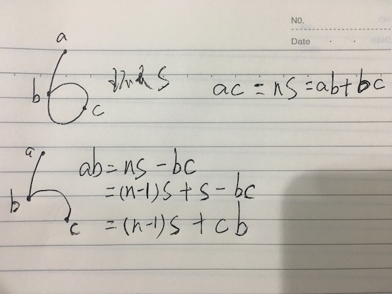

## 题目要求：
##### 给出俩个单向链表的头指针，比如h1，h2，判断这俩个链表是否相交。
##### 这个题目可以扩展成很多问题，每个子问题都值得学习。
<!--more-->
## 题目扩展（均为单链表）：
1. 判断这俩个链表是否相交（无环）
2. 判断链表是否有环
3. 如何知道环的长度？
4. 如何找出环的连接点在哪里？
5. 带环链表的长度是多少？
6. 链表有环，判断相交
7. 判断两个链表相交的第一个节点
##### 下面我们一个一个的来解决这些问题

### 问题1：判断这俩个链表是否相交（无环）
##### 两个无环链表的相交问题，如果两个链表相交，则他们一定存在公共节点，且公共节点之后的节点全部都是相交的。则他们的结构为：

##### 如果两个链表相交，则他们的尾节点一定是同一个节点，所以可以直接对比两个链表的尾部节点是否相。时间复杂度为两个链表的长度之和O(m+n)。
##### 这种解法比较简单，只要想到最后一个节点相等就可以，后面还会有一些其他的解法介绍。

### 问题2：判断链表是否有环
##### 对于这个问题，可以使用一种追赶的方法。设定两个指针slow、fast，从头指针开始，每次分别前进1步、2步。如存在环，则两者相遇；如不存在环，fast遇到NULL退出。
##### 这个过程比较好理解，如果存在环，所以fast指针则会在环内循环，直至slow指针进入环内，并且追赶上slow指针。因为fast每次两部，slow每次一步，试验后发现fast指针不会跳过slow指针，因此如果有换，则必定会在一个节点相交。

### 问题3：如何知道环的长度？
##### 基于上一步，我们已经判断一个链表是否有环，如果有环的话，如何判断环的长度呢。
##### 还是一样的方法，在上一个问题中，fast和slow将相交于环内一点，fast的速度是slow的两倍，则只需要fast和slow继续以原速度前进，当他们再次相交时，slow所走了步数为环的长度。

### 问题4：如何找出环的连接点在哪里？
##### 相对于上面两个问题，这个问题相对更复杂一些。回到问题"判断链表是否有环"。
##### 当fast指针和slow指针相交时，slow指针必定未走完一圈，因为在slow进入环入口时，fast指针已经在环内，这就成了一个fast追赶slow的问题，除了fast和slow已经相交，否则fast追赶上slow，slow用不了一周。因此此时slow还未第二次经过入口节点。
1. 假设slow进过的节点数量为r，则fast为2r
2. 假设环的长度为s，因为slow和fast已经在同一点，而fast比slow多走了r个节点，所以r = ns。n为常数，大于等于1，代表的是fast绕环的次数。
3. 假设头节点为点a，入口节点为b，fast和slow相遇节点为c，则ac = r = ns = ab + bc；bc + cb = s；（bc表示从入口节点至相遇节点，cb表示从相遇节点至入口节点） ab = r - bc；所以，ab - cb = (n-1)s；

##### 因此，从头节点a和相遇节点c重新开始走，第一次相遇的节点为入口节点b。从a节点走的指针步数为1，从c节点走的指针步数则大于等于1,因为大于1时，无非就是n大一些，多走了几圈。

### 问题5：带环链表的长度是多少？
##### 问题4可以求出头节点到入口节点的长度，加上问题3的环长度，等于链表长度。或者问题4求出入口节点，以及问题2的相遇节点。都可以求出链表长度。

### 问题6：链表有环，判断相交
##### 一个链表有环，一个链表无环的情况下。两个链表不可能相交。
##### 两个链表均有环，则两个链表的环一定是共有的。则可以判断一个链表的相遇点，相遇点一定处于环内，再判断该点是否存在于另一个链表当中。