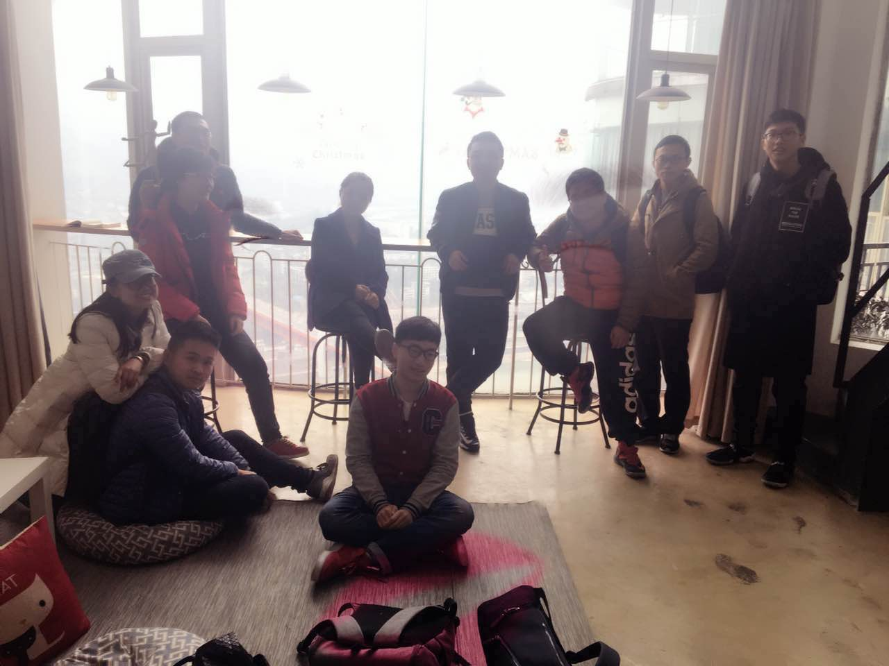
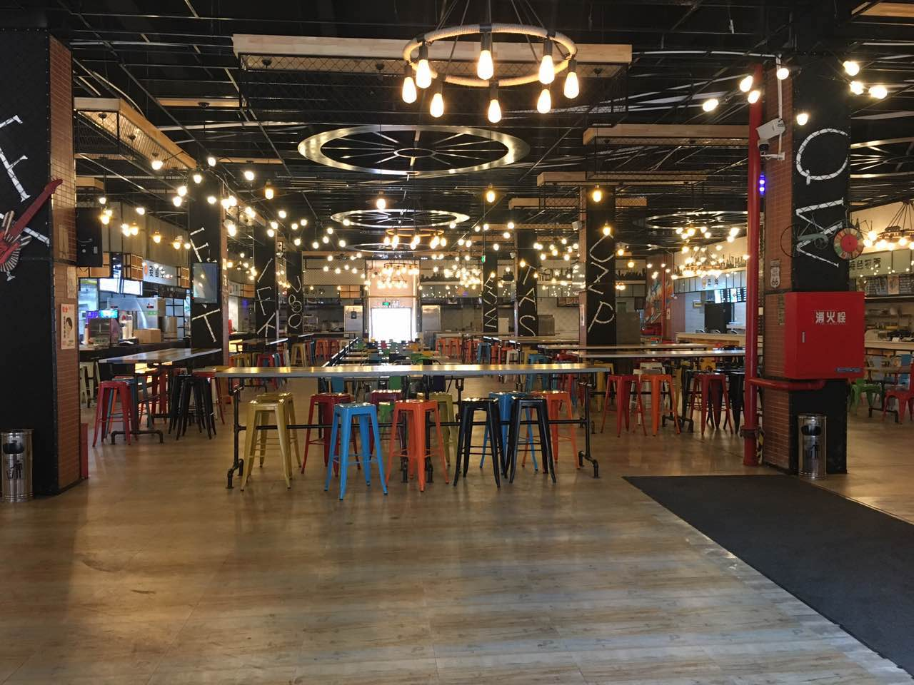
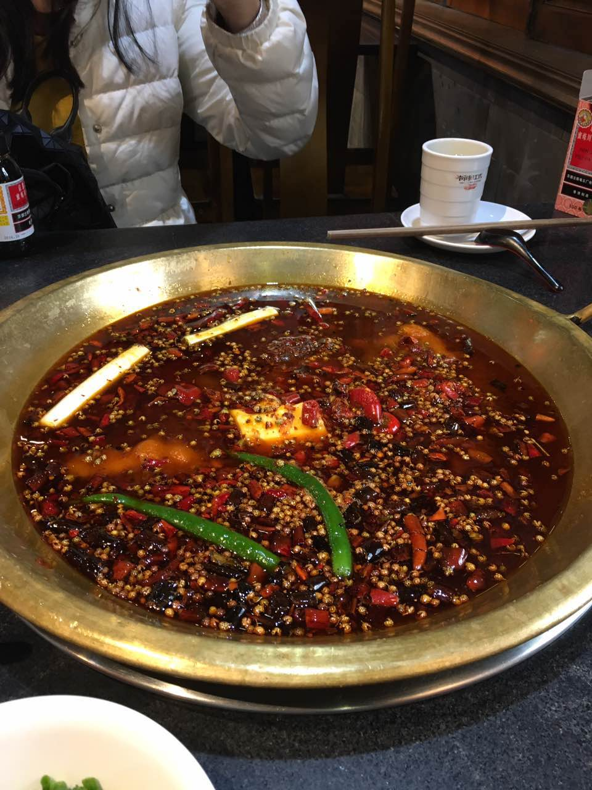
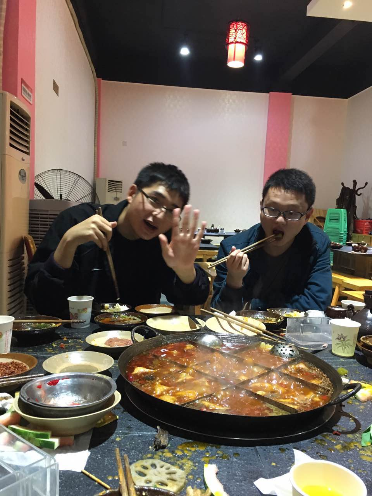
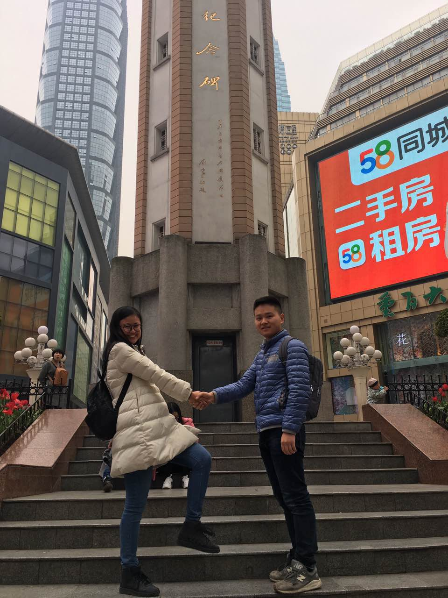

##### 　　去年6月份毕业之后，怎么也没有先到这么快又回到的重庆。之前想过很多次，再到重庆的时候会是什么时候，可能是几年后的同学聚会，可能是工作休假去重庆游玩。但是无论怎样，也没有想到仅仅隔了半年就又到了重庆。
<!--more-->

##### 　　这次去重庆是因为部门的团建，原本计划去韩国或者是成都，投票之后就决定去重庆了（醉了）。其实我去重庆读书的时候，对重庆是没有多少感情的，觉得这个城市很陌生，没有家里好，这种感觉一直持续到大四，直到我离开重庆去北京工作和实习，才发现我已经对重庆有了一种莫名的情感在里面，虽然我没有在这里恋爱。这种情感在我下了飞机以后则更加明显。

##### 　　到达重庆江北机场是在3月3号的凌晨1点，之前的一天我们还在公司卖力的工作。下了飞机以后便往预定的青年旅社赶，但是我们根本不是去休息的，因为我们的重庆之旅才刚刚开始，没有人想早早的睡觉。凌晨1点的重庆已经没有平时的拥堵，但是走在路上，我还是有一种特别熟悉的感觉，我对秋薇说，我好想还是一个学生。

    
青年旅舍合影

##### 　　我确实变成了一个学生，在我第二天来到重邮之后。公司没有组织大家集体活动，都是各自行动。第二天在离开青舍，找到酒店之后，我和秋薇便直奔重邮。说来很巧，我们住的酒店在解放碑，这里正好有346路公交车直达重邮。一路上的风景还是没有变，路过了南坪，路过了会展中心。其实大学期间我并没有去过重庆的多少地方，因为本身比较宅，加上整天和几个大老爷们待在一起，所以重庆的路我认识的实在不多，这点也被同事们吐槽了。

##### 　　重邮在我眼里几乎就没有变，除了千喜鹤食堂。我顺着数图、老操场、篮球场、千喜鹤来到28栋。不知道是因为这条路太过于熟悉，还是学校变化实在不大，我没有了之前的激动，心情也慢慢平复下来。这一圈走完之后，竟然想着快点离开。当然，离开之前又去了一次"火山石烫鱼"。

    
重邮新食堂

    
火山石烫鱼

##### 　　如果说我为什么在离开重邮的时候又喜欢上了重庆，一定是因为那些人，那些同学和朋友。第二天我就见到了磊哥，还是原来的样子，几乎没有变。我们都是性格含蓄的人。因为时间比较紧，只和磊哥聊了一个小时左右，我们说了很多毕业后的感受，没有装逼，没有浮夸，说的都是真心话。磊哥确实变了，变成熟了，不再那么放荡不羁了。直到现在我都在想，我应该和磊哥去喝上几杯的。哎，不知道下次见面是什么时候。

    
余磊和刘航

##### 　　按道理来说，重庆应该是比北京更加湿润的。但我的症状却恰恰相反，因为没有唇膏，加上女朋友"舍不得"给我买新的，我的嘴唇周围已经干到龟裂。这实在是难受。后来分析可能是因为酒店的房间里面太干燥了。女朋友则比我更惨一些，亲戚来了，加上肚子疼，再加上感冒发烧导致声音沙哑，已经到了不能说话的地步。实在是好过不到哪里去。不过幸好有我的悉心照顾，最后安全返回北京。

    
秋薇和我

