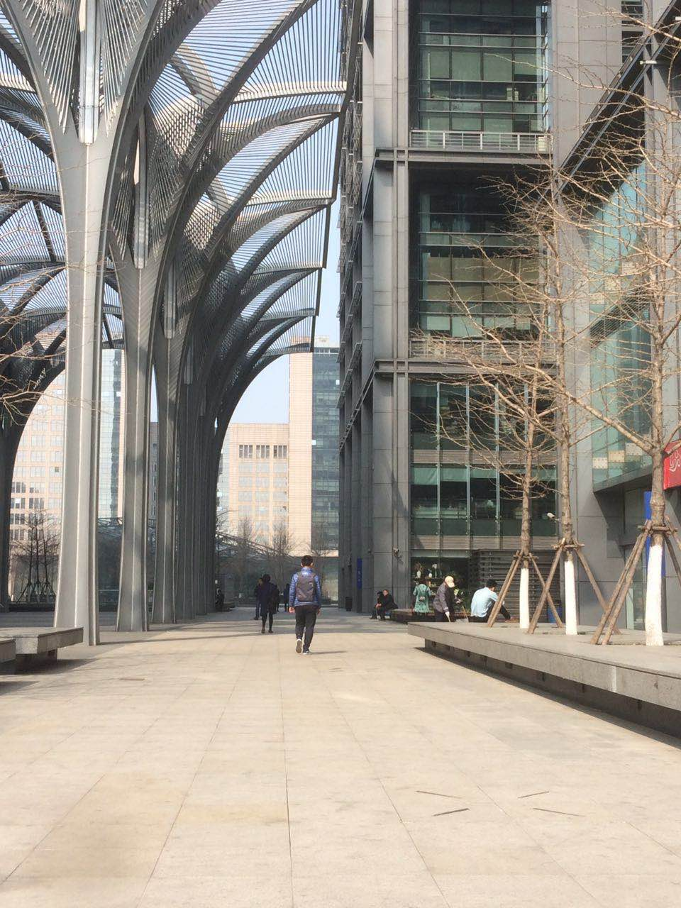

##### 其实今天的事情远没有标题说的这么严重，但是我确实很重视这次面试。快手的第一次面试。

##### 面试的前半部分非常顺利，聊了一些在去哪儿的工作以及系统。直到面试官问我来快手希望做哪方面的工作。身为一个java开发，居然说最想作算法方面的工作，虽然我极力强调我只是对算法比较感兴趣，实在没有多专业，如果可以我很希望可以往这方面发展。但是面试官还是给了我一道比较专业的算法题。加上后面的一些表现。导致这次面试的失败。

<!--more-->

##### 快手确实是一个我很想去的公司，但是我却没有为这次面试做足够的准备。面试出来以后说不难过是假的。
##### 人生十有八九都是不如意的，失败也是为了更好的前进。整装待发，继续前进吧。
#### 附上一张女朋友拍的面试背影

## 面试算法题
### 不输入任何参数，尽量精确的计算p值
##### 解题过程现在还不是很会，和概率论和积分有关，好好看看再记录下来吧。
### 偶数的数组里面有一些正数，分成两个大小一样的子数组，两个数组之和尽量相等
##### [解题思路](../../arithmetic/array1/)