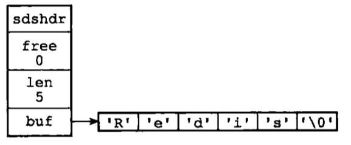

##### redis是基于C语言的，但是redis没有直接使用C语言的传统字符串，而是自己构建了一种简单动态字符串的抽象类型。简称SDS；
<!--more-->
### SDS数据结构
##### 每个sds.h/sdshdr结构表示一个SDS值：
```C
struct sdshdr{

    //记录buf数组汇总已使用字节的数量，等于SDS所保存字符串的长度
    int len;

    //记录buf数组中未使用字节的数量
    int free;

    //字节数组，用于保存字符串
    char buf[];
}
```
##### SDS结构实例：
 <div class='img-note'>SDS实例</div>

1. free属性的值为0，表示SDS没有未使用空间。
2. len的属性值为5，表示这个SDS保存了一个5字节长的字符串。
3. buf属性是一个char数组，保存了redis五个字符

##### SDS遵循C字符串以空字符结尾的惯例，该空字符的1字节空间不计算在SDS的len属性里面。并且添加空字符到字符串末尾的操作，是由SDS函数自动完成的。之所以保留这空字符结尾的好处是，SDS可以重用一部分C字符串函数库里面的函数。

### SDS与C字符串的区别
#### 常数复杂度获取字符串长度
##### 因为C字符串不记录自身的长度，所以获取一个C字符串的长度，需要遍历整个字符串，直到遇到空字符为止，复杂度为O(N)。而redis的SDS只需要读取len字段就可以知道其字符串长度，复杂度为O(1)。更新和设置SDS的长度是API自动完成的。
##### 虽然这种操作SDS的数据结构能够很好的提高效率，但是作为代价，SDS维护这些信息的时候也是需要成本的。只是这种代价所带来的好处是值得的。

