##### 最近因为项目要求，需要在本地环境为项目部署https服务。之前对https的密钥和证书过程都不是很清楚，所以最近恶补了一些基础知识。这是一篇对数字证书很形象的解释，所以决定记录下来，加深记忆。
<!--more-->

#### 1.鲍勃有两把钥匙，一把是公钥，另一把是私钥。
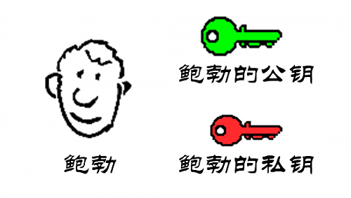

#### 2.鲍勃把公钥送给他的朋友们—-帕蒂、道格、苏珊—-每人一把。
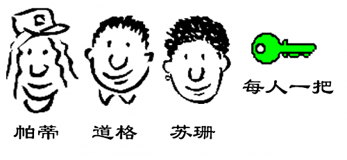

#### 3.苏珊给鲍勃写信，写完后用鲍勃的公钥加密，达到保密的效果。
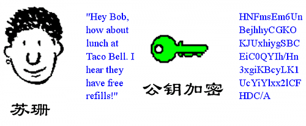

#### 4.鲍勃收信后，用私钥解密，看到信件内容。
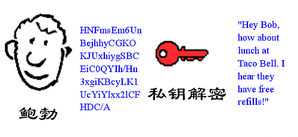

#### 5.鲍勃给苏珊回信，写完后用Hash函数，生成信件的摘要（digest）。
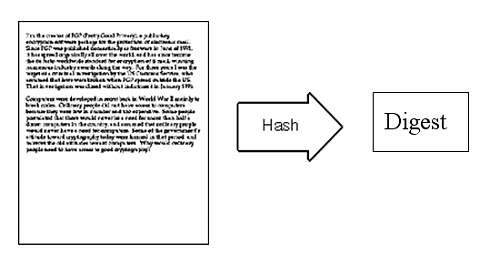

#### 6.然后，鲍勃使用私钥，对这个摘要加密，生成”数字签名”（signature）。
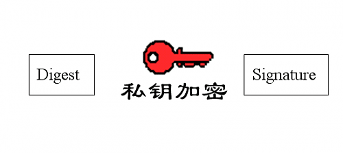

#### 7.鲍勃将这个签名，附在信件下面，一起发给苏珊。
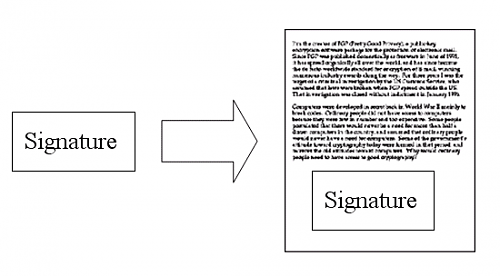

#### 8.苏珊收信后，取下数字签名，用鲍勃的公钥解密，得到信件的摘要。由此证明，这封信确实是鲍勃发出的。
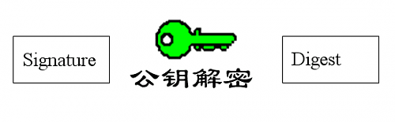

#### 9.苏珊再对信件本身使用Hash函数，将得到的结果，与上一步得到的摘要进行对比。如果两者一致，就证明这封信未被修改过。
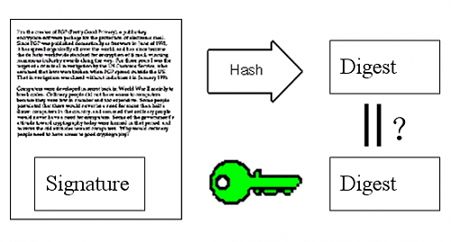

#### 10.复杂的情况出现了。道格想欺骗苏珊，他偷偷使用了苏珊的电脑，用自己的公钥换走了鲍勃的公钥。因此，他就可以冒充鲍勃，写信给苏珊。
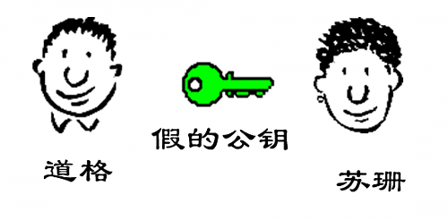

#### 11.苏珊发现，自己无法确定公钥是否真的属于鲍勃。她想到了一个办法，要求鲍勃去找”证书中心”（certificate authority，简称CA），为公钥做认证。证书中心用自己的私钥，对鲍勃的公钥和一些相关信息一起加密，生成”数字证书”（Digital Certificate）。
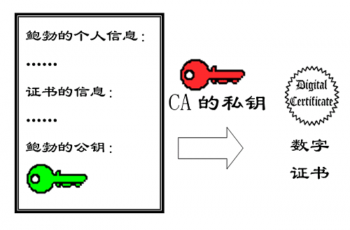

#### 12.鲍勃拿到数字证书以后，就可以放心了。以后再给苏珊写信，只要在签名的同时，再附上数字证书就行了。
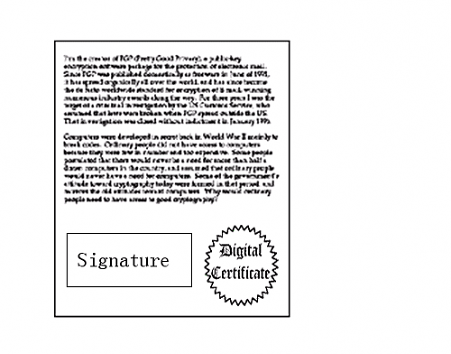

#### 13.苏珊收信后，用CA的公钥解开数字证书，就可以拿到鲍勃真实的公钥了，然后就能证明”数字签名”是否真的是鲍勃签的。
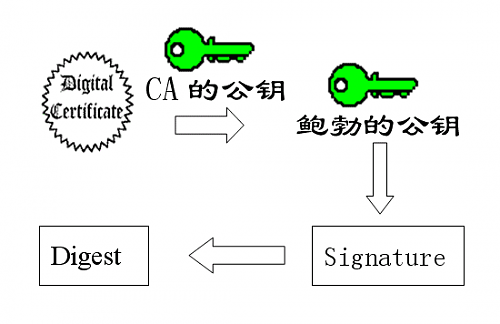

#### 14.下面，我们看一个应用”数字证书”的实例：https协议。这个协议主要用于网页加密。

#### 15.首先，客户端向服务器发出加密请求。
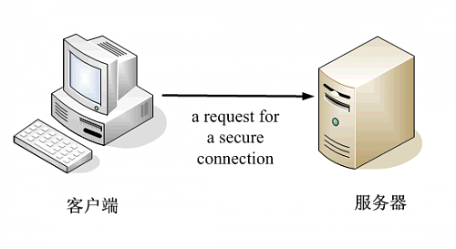

#### 16.服务器用自己的私钥加密网页以后，连同本身的数字证书，一起发送给客户端。
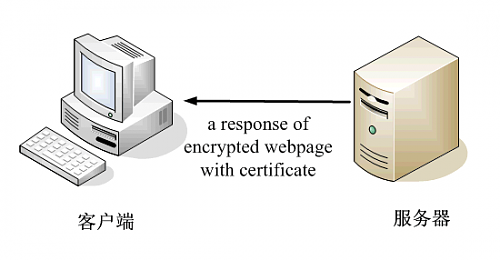

#### 17.客户端（浏览器）的”证书管理器”，有”受信任的根证书颁发机构”列表。客户端会根据这张列表，查看解开数字证书的公钥是否在列表之内。
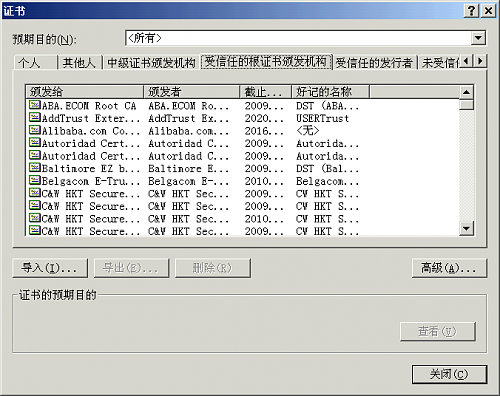

#### 18.如果数字证书记载的网址，与你正在浏览的网址不一致，就说明这张证书可能被冒用，浏览器会发出警告。
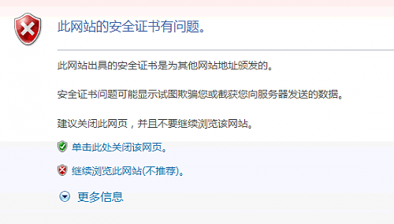

#### 19.如果这张数字证书不是由受信任的机构颁发的，浏览器会发出另一种警告。
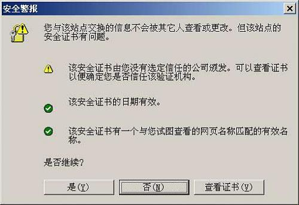

#### 20.如果数字证书是可靠的，客户端就可以使用证书中的服务器公钥，对信息进行加密，然后与服务器交换加密信息。
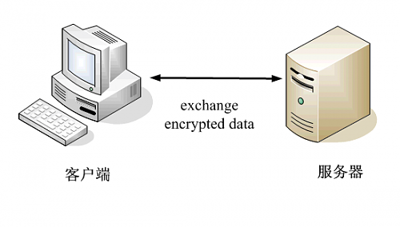

### 想更好地理解上面这篇形象生动的技术文章，你还需要理解一些概念和术语
#### 公钥密码体制(public-key cryptography)
##### 公钥密码体制分为三个部分，公钥、私钥、加密解密算法，它的加密解密过程如下：
* 加密：通过加密算法和公钥对内容(或者说明文)进行加密，得到密文。加密过程需要用到公钥。
* 解密：通过解密算法和私钥对密文进行解密，得到明文。解密过程需要用到解密算法和私钥。注意，由公钥加密的内容，只能由私钥进行解密，也就是说，由公钥加密的内容，如果不知道私钥，是无法解密的。
##### 公钥密码体制的公钥和算法都是公开的(这是为什么叫公钥密码体制的原因)，私钥是保密的。大家都以使用公钥进行加密，但是只有私钥的持有者才能解密。在实际的使用中，有需要的人会生成一对公钥和私钥，把公钥发布出去给别人使用，自己保留私钥。

#### 对称加密算法(symmetric key algorithms)
##### 在对称加密算法中，加密使用的密钥和解密使用的密钥是相同的。也就是说，加密和解密都是使用的同一个密钥。因此对称加密算法要保证安全性的话，密钥要做好保密，只能让使用的人知道，不能对外公开。这个和上面的公钥密码体制有所不同，公钥密码体制中加密是用公钥，解密使用私钥，而对称加密算法中，加密和解密都是使用同一个密钥，不区分公钥和私钥。
##### 密钥，一般就是一个字符串或数字，在加密或者解密时传递给加密/解密算法。前面在公钥密码体制中说到的公钥、私钥就是密钥，公钥是加密使用的密钥，私钥是解密使用的密钥

[原文连接](http://www.youdzone.com/signature.html)
