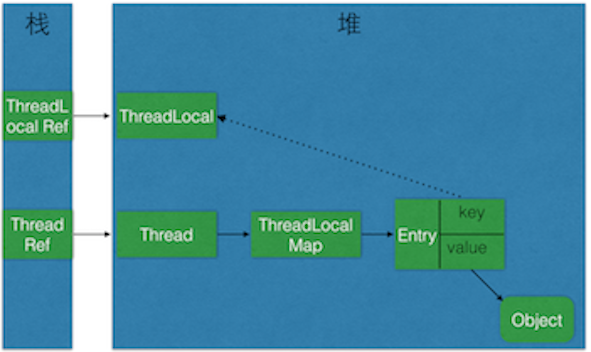

## ThreadLocal是什么
##### This class provides thread-local variables.  These variables differ from their normal counterparts in that each thread that accesses one (via its <tt>get</tt> or <tt>set</tt> method) has its own, independently initialized copy of the variable.  <tt>ThreadLocal</tt> instances are typically private static fields in classes that wish to associate state with a thread (e.g., a user ID or Transaction ID).
<!--more-->

### 这是ThreadLocal源码中一段介绍，翻译过来的大概意思是：
##### ThreadLocal类用来提供线程内部的局部变量。这种变量在多线程环境下访问(通过get或set方法访问)时能保证各个线程里的变量相对独立于其他线程内的变量。ThreadLocal实例通常来说都是private static类型的，用于关联线程和线程的上下文。

##### 这种解释和网络上所说的解决多线程的并发问题不太一样，当你把一个变量复制成了多份，我觉得这种方式并不叫解决多线程访问资源时的共享问题。本质上来说资源已经变成了多份，没有共享之说，当然这也是一种解决方式，但是如果资源不必线程共享，又何必要用ThreadLocal去实现呢。

#### 总结来说：ThreadLocal的作用是提供线程内的局部变量，这种变量在线程的生命周期内起作用，减少同一个线程内多个函数或者组件之间一些公共变量的传递的复杂度。
##### 举一个例子，一个请求需要按照1、2、3这个顺序执行3个函数。但是其中有一个参数是需要函数1提供给函数3使用的，但是这个参数对于函数2来说并没有作用（实际情况可能比这要复杂的多）。同时我们又不希望污染函数2，那么如何将该参数通过函数1传递到函数3呢？ThreadLocal是一个比较合理的解决方法。

## ThreadLocal代码演示

```JAVA
/**
 * Created BY wangwenxiang on 2017/3/15.
 */
public class ThreadLocalTest {
    private static ThreadLocal<Integer> integerThreadLocal = new ThreadLocal<Integer>();

    /**
     * 初始化并输出每个线程的ThreadLocal
     * Runnable
     * name
     */
    private static Thread[] initThread(){
        Thread[] threads = new Thread[10];
        for (int i=0;i<10;i++){
            final int finalI = i;
            threads[i] = new Thread(new Runnable() {
                public void run() {
                    integerThreadLocal.set(finalI);
                    System.out.println(Thread.currentThread().getName()+": "+integerThreadLocal.get());
                }
            },"thread-" + i);
        }
        return threads;
    }


    public static void main(String[] args) {
        Thread[] threads = initThread();
        for (Thread thread : threads){
            thread.start();
        }
    }
}
```

##### ThreadLocal的操作非常简单，基本上没有太多的过程。

##### 执行结果：
```
thread-0: 0
thread-1: 1
thread-2: 2
thread-3: 3
thread-4: 4
thread-5: 5
thread-6: 6
thread-7: 7
thread-8: 8
thread-9: 9
```

##### 可以看出虽然只创建了一个ThreadLocal对象，但是每个线程的初始化之后，得出来的结果并不一样。各个线程之间的值是相互独立的。

## ThreadLocal源码
### 构造函数
```java
/**
 * Creates a thread local variable.
 */
public ThreadLocal() {
}
```
##### 这是ThreadLocal唯一的构造函数，什么也没做

### set方法
```JAVA
/**
 * Sets the current thread's copy of this thread-local variable
 * to the specified value.  Most subclasses will have no need to
 * override this method, relying solely on the {@link #initialValue}
 * method to set the values of thread-locals.
 *
 * @param value the value to be stored in the current thread's copy of
 *        this thread-local.
 */
public void set(T value) {
        Thread t = Thread.currentThread();
        ThreadLocalMap map = getMap(t);
        if (map != null)
            map.set(this, value);
        else
            createMap(t, value);
    }
```
##### 代码比较简单

1. 获取当前线程 `Thread t = Thread.currentThread();`
2. 获取当前线程的ThreadLocalMap，使得每个线程的本地数据相互隔离的原因也在于这里，因为每个线程都有自己的ThreadLocalMap；
3. 判断ThreadLocalMap是否为空，直接插入或者创建map并插入；

#### ThreadLocalMap的set方法
```JAVA
/**
 * Set the value associated with key.
 * @param value the value to be set
 *
 * @param key the thread local object
 */
private void set(ThreadLocal key, Object value) {

    // We don't use a fast path as with get() because it is at
    // least as common to use set() to create new entries as
    // it is to replace existing ones, in which case, a fast
    // path would fail more often than not.

    Entry[] tab = table;
    int len = tab.length;
    int i = key.threadLocalHashCode & (len-1);

    for (Entry e = tab[i];
         e != null;
         e = tab[i = nextIndex(i, len)]) {
        ThreadLocal k = e.get();

        if (k == key) {
            e.value = value;
            return;
        }

        if (k == null) {
            replaceStaleEntry(key, value, i);
            return;
        }
    }

    tab[i] = new Entry(key, value);
    int sz = ++size;
    if (!cleanSomeSlots(i, sz) && sz >= threshold)
        rehash();
}
```
##### map的key和value分别对应的是ThreadLocal本身和往ThreadLocal中set的值。

1. 首先根据ThreadLocal元素的hashCode计算出其数组下标；由于数组的长度用于等于2<sup>n</sup>个，所以下表的取值范围在0到2<sup>n</sup>-1；
2. for循环，从数组位置i开始以步长1向后循环遍历，直到找到一个空位，每次循环将该位置的值赋值给e；
3. 当数组位置不为空时执行方法体：
    1. 获得该数组位置的ThreadLocal，判断是否与当前ThreadLocal相等，如果相等，则将value更新，set方法结束；
    2. 如果该ThreadLocal为空，则替换，然后结束方法。
4. 在位置i插入新值，计数加1

### get方法
```JAVA
/**
  * Returns the value in the current thread's copy of this
  * thread-local variable.  If the variable has no value for the
  * current thread, it is first initialized to the value returned
  * by an invocation of the {@link #initialValue} method.
  *
  * @return the current thread's value of this thread-local
  */
public T get() {
        Thread t = Thread.currentThread();
        ThreadLocalMap map = getMap(t);
        if (map != null) {
            ThreadLocalMap.Entry e = map.getEntry(this);
            if (e != null)
                return (T)e.value;
        }
        return setInitialValue();
    }
```
##### get方法和set方法比较类似，首先获取当前线程，并获取线程的ThreadLocalMap，以当前的ThreadLocal作为key在map中获取value，判断value是否为null，如果为null，则将当前的ThreadLocal中设置初始值，并返回改值。
#### setInitialValue()
```JAVA
/**
 * Variant of set() to establish initialValue. Used instead
 * of set() in case user has overridden the set() method.
 *
 * @return the initial value
 */
private T setInitialValue() {
    T value = initialValue();
    Thread t = Thread.currentThread();
    ThreadLocalMap map = getMap(t);
    if (map != null)
        map.set(this, value);
    else
        createMap(t, value);
    return value;
}
```
##### 该方法和set方法基本一样
#### initialValue()
```JAVA
/**
 * Returns the current thread's "initial value" for this
 * thread-local variable.  This method will be invoked the first
 * time a thread accesses the variable with the {@link #get}
 * method, unless the thread previously invoked the {@link #set}
 * method, in which case the <tt>initialValue</tt> method will not
 * be invoked for the thread.  Normally, this method is invoked at
 * most once per thread, but it may be invoked again in case of
 * subsequent invocations of {@link #remove} followed by {@link #get}.
 *
 * <p>This implementation simply returns <tt>null</tt>; if the
 * programmer desires thread-local variables to have an initial
 * value other than <tt>null</tt>, <tt>ThreadLocal</tt> must be
 * subclassed, and this method overridden.  Typically, an
 * anonymous inner class will be used.
 *
 * @return the initial value for this thread-local
 */
 protected T initialValue() {
     return null;
 }
```
##### 该方法只在get方法中被调用，当ThreadLocal中没有设置value时。默认返回null，protected的访问权限表示该方法支持被覆盖。

### ThreadLocalMap
##### ThreadLocalMap是使用ThreadLocal的弱引用作为Key的
```JAVA
static class ThreadLocalMap {
        /**
         * The entries in this hash map extend WeakReference, using
         * its main ref field as the key (which is always a
         * ThreadLocal object).  Note that null keys (i.e. entry.get()
         * == null) mean that the key is no longer referenced, so the
         * entry can be expunged from table.  Such entries are referred to
         * as "stale entries" in the code that follows.
         */
        static class Entry extends WeakReference<ThreadLocal> {
            /** The value associated with this ThreadLocal. */
            Object value;

            Entry(ThreadLocal k, Object v) {
                super(k);
                value = v;
            }
        }
        ...
        ...
}
```

##### 下图是本文介绍到的一些对象之间的引用关系图，实线表示强引用，虚线表示弱引用：
 <div class='img-note'>ThreadLocal对象引用</div>

##### 如上图，ThreadLocalMap使用ThreadLocal的弱引用作为key，如果一个ThreadLocal没有外部强引用引用他，那么系统gc的时候，这个ThreadLocal势必会被回收，这样一来，ThreadLocalMap中就会出现key为null的Entry，就没有办法访问这些key为null的Entry的value，如果当前线程再迟迟不结束的话，这些key为null的Entry的value就会一直存在一条强引用链：
#### Thread Ref -> Thread -> ThreaLocalMap -> Entry -> value
##### 永远无法回收，造成内存泄露。

##### 其实，在JDK的ThreadLocalMap的设计中已经考虑到这种情况，也加上了一些防护措施，下面是ThreadLocalMap的`getEntry`方法的源码：
```JAVA
private Entry getEntry(ThreadLocal key) {
    int i = key.threadLocalHashCode & (table.length - 1);
    Entry e = table[i];
    if (e != null && e.get() == key)
        return e;
    else
        return getEntryAfterMiss(key, i, e);
}
```
#### 当Entry为null时，getEntryAfterMiss方法
```java
private Entry getEntryAfterMiss(ThreadLocal key, int i, Entry e) {
    Entry[] tab = table;
    int len = tab.length;
    while (e != null) {
        ThreadLocal k = e.get();
        if (k == key)
            return e;
        if (k == null)
            expungeStaleEntry(i);
        else
            i = nextIndex(i, len);
        e = tab[i];
    }
    return null;
}
```

#### `expungeStaleEntry`函数的源码：
```java
private int expungeStaleEntry(int staleSlot) {
    Entry[] tab = table;
    int len = tab.length;

    // expunge entry at staleSlot
    tab[staleSlot].value = null;
    tab[staleSlot] = null;
    size--;

    // Rehash until we encounter null
    Entry e;
    int i;
    for (i = nextIndex(staleSlot, len);
         (e = tab[i]) != null;
         i = nextIndex(i, len)) {
        ThreadLocal k = e.get();
        if (k == null) {
            e.value = null;
            tab[i] = null;
            size--;
        } else {
            int h = k.threadLocalHashCode & (len - 1);
            if (h != i) {
                tab[i] = null;

                // Unlike Knuth 6.4 Algorithm R, we must scan until
                // null because multiple entries could have been stale.
                while (tab[h] != null)
                    h = nextIndex(h, len);
                tab[h] = e;
            }
        }
    }
    return i;
}
```

##### 整理一下ThreadLocalMap的`getEntry`函数的流程：

1. 首先从ThreadLocal的直接索引位置(通过ThreadLocal.threadLocalHashCode & (len-1)运算得到)获取Entry e，如果e不为null并且key相同则返回e；
2. 如果e为null或者key不一致则向下一个位置查询，如果下一个位置的key和当前需要查询的key相等，则返回对应的Entry，否则，如果key值为null，则擦除该位置的Entry，否则继续向下一个位置查询

##### 在这个过程中遇到的key为null的Entry都会被擦除，那么Entry内的value也就没有强引用链，自然会被回收。仔细研究代码可以发现，`set`操作也有类似的思想，将key为null的这些Entry都删除，防止内存泄露。
##### 但是光这样还是不够的，上面的设计思路依赖一个前提条件： 要调用ThreadLocalMap的`getEntry`函数或者`set`函数。 这当然是不可能任何情况都成立的，所以很多情况下需要使用者手动调用ThreadLocal的`remove`函数，手动删除不再需要的ThreadLocal，防止内存泄露。所以JDK建议将ThreadLocal变量定义成`private static`的，这样的话ThreadLocal的生命周期就更长，由于一直存在ThreadLocal的强引用，所以ThreadLocal也就不会被回收，也就能保证任何时候都能根据ThreadLocal的弱引用访问到Entry的value值，然后remove它，防止内存泄露。